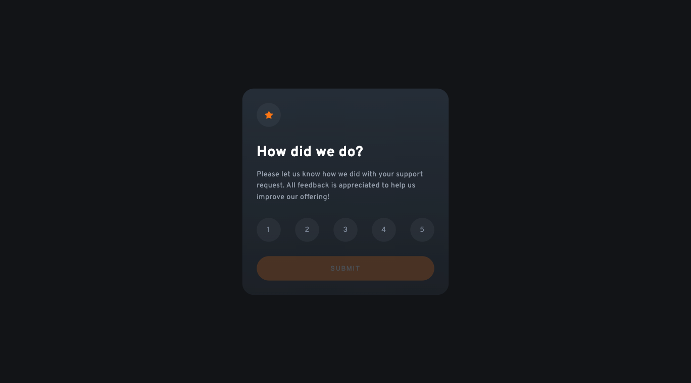
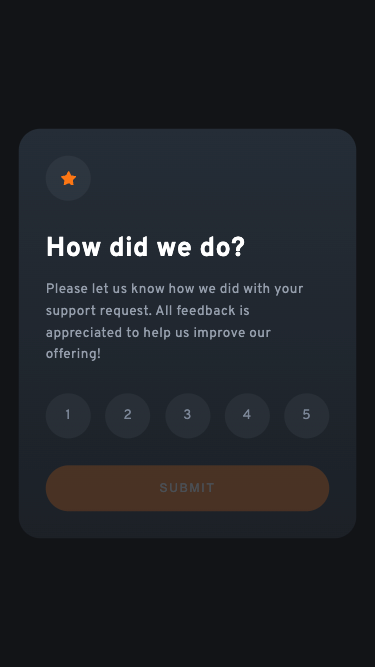

# Frontend Mentor - Interactive rating component

### Design Preview

This is a solution to the [Interactive rating component challenge on Frontend Mentor](https://www.frontendmentor.io/challenges/interactive-rating-component-koxpeBUmI). Frontend Mentor challenges help you improve your coding skills by building realistic projects.

## Table of contents

- [Overview](#overview)
  - [The challenge](#the-challenge)
  - [Screenshot](#screenshot)
  - [Links](#links)
- [My process](#my-process)
  - [Built with](#built-with)
  - [What I learned](#what-i-learned)
- [Author](#author)

## Overview

### The challenge

Users should be able to:

- View the optimal layout for the app depending on their device's screen size
- See hover states for all interactive elements on the page
- Select and submit a number rating
- See the "Thank you" card state after submitting a rating

### Screenshot
#### Desktop
| Initial | Success |
|------------|-------------|
|  |  |
#### Mobile
| Initial | Success |
|------------|-------------|
 |  |  |

### Links

- Solution URL: [https://github.com/sjneri/interactive-rating](https://github.com/sjneri/interactive-rating)
- Live Site URL: [https://sjneri.github.io/interactive-rating/](https://sjneri.github.io/interactive-rating/)

## My process

### Built with

- Semantic HTML5 markup
- CSS custom properties
- Flexbox
- JavaScript

### What I learned

- For Loop
- JS Event Lister

## Author
Stephen John Neri
- [Github](https://github.com/sjneri)
- [LinkedIn](https://www.linkedin.com/in/stephenjohnneri/)